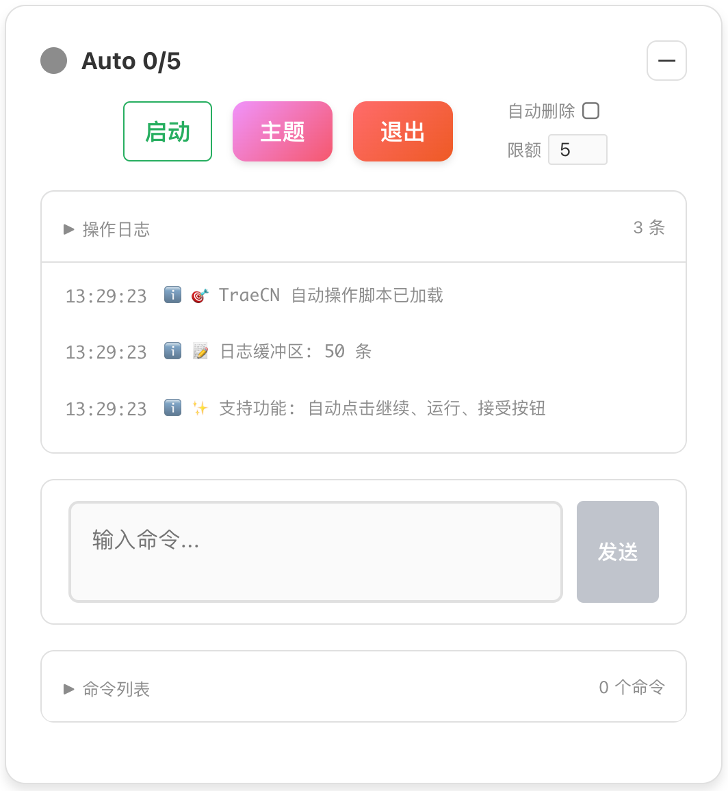
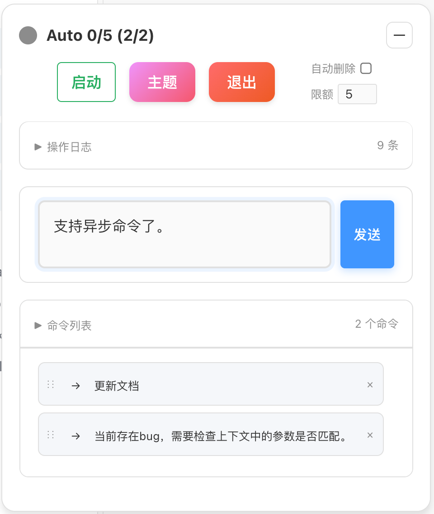
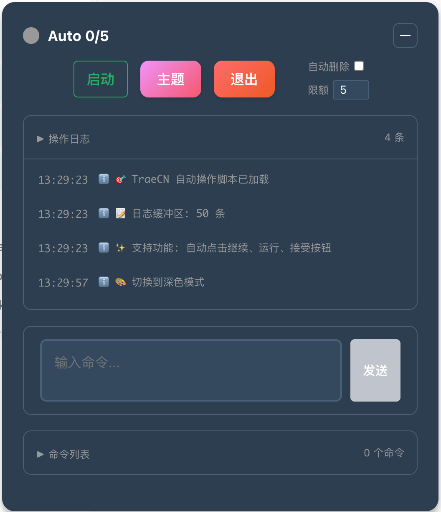

# Trae Auto Accept - TraeCN 自动接受扩展

专为 TraeCN 设计的 VS Code 扩展，提供自动化"接受全部"按钮点击功能。

## 🎯 功能特点

- 🎯 **TraeCN 专用**：针对 TraeCN 界面深度优化
- 🤖 **自动点击**：智能监控并点击"接受全部"按钮  
- 🎨 **精美界面**：深色/浅色主题，可拖拽控制面板
- 📱 **响应式设计**：最小化功能，优雅的交互体验
- 🛡️ **安全可靠**：本地运行，无网络请求，保护隐私

## 📥 安装指南

1. **下载扩展包**
   - 访问 [GitHub Releases](https://github.com/luw2007/trae-auto-accept/releases)
   - 下载最新的 `trae-auto-accept.vsix` 文件

2. **安装到 VS Code**
   - 打开 VS Code
   - 按 `Ctrl+Shift+P`（Windows/Linux）或 `Cmd+Shift+P`（macOS）
   - 输入：`Extensions: Install from VSIX...`
   - 选择下载的 `trae-auto-accept.vsix` 文件
   - 等待安装完成

3. **重启 VS Code**
   - 安装完成后重启 VS Code 确保扩展正常加载


## 🚀 使用流程

### 首次使用

1. **启动扩展**
   - 按 `Ctrl+Shift+P`
   - 输入：`启动 Trae 自动接受`
   - 按回车执行

2. **自动复制脚本**
   - 扩展会自动将浏览器脚本复制到剪贴板
   - 会显示提示信息："📋 浏览器脚本已复制到剪贴板，请在浏览器控制台中运行"

3. **打开浏览器控制台**
   - 会自动将 js 脚本复制到剪切板中。
   - 并且会自动打开 TraeCN 的开发人员工具
   - 手工切换到"控制台"标签

4. **运行脚本**
   - 在控制台中粘贴脚本（`Ctrl+V`）
   - 按回车执行

5. **开始使用**
   - 页面右上角会出现控制面板
   - 点击"启动"按钮开始自动接受
   - 控制面板可以拖拽移动位置

### 软件截图






### 日常使用

- **启动/停止**：点击控制面板的"启动"/"停止"按钮
- **切换主题**：点击"主题"按钮切换深色/浅色模式
- **最小化**：点击"－"按钮收起面板
- **展开**：点击最小化后的面板或"+"按钮
- **退出**：点击"退出"按钮完全移除脚本

## 🎮 浏览器脚本功能

### 控制面板
- **启动/停止**：一键切换自动接受状态
- **主题切换**：深色/浅色主题自由切换
- **最小化**：收起为小巧图标，节省空间
- **退出**：完全移除脚本和界面

### 智能特性
- **按钮验证**：检查按钮文本为"全部接受"才点击
- **可见性检测**：只点击可见的按钮
- **自动收起**：启动后3秒自动最小化
- **拖拽移动**：可拖动到任意位置
- **状态指示**：彩色圆点显示运行状态

## 🔧 故障排除

### 扩展无法启动
- 检查 VS Code 版本是否为 1.74.0+
- 重启 VS Code
- 重新安装扩展

### 脚本无法执行
- 确保在 TraeCN 页面运行脚本
- 检查浏览器控制台是否有错误信息
- 重新复制脚本到控制台

### 按钮无法点击
- 确保页面已完全加载
- 检查"接受全部"按钮是否存在
- 手动点击一次按钮测试功能

### 控制面板不显示
- 刷新页面重新运行脚本
- 检查是否有其他脚本冲突
- 清除浏览器缓存重试

## 📁 文件结构

```
trae-auto-accept/
├── package.json              # 扩展配置清单
├── extension.js              # VS Code 扩展主程序
├── trae-browser-script.js    # 浏览器自动化脚本
├── build.sh                 # 自动构建脚本
├── trae-auto-accept.vsix    # 打包好的扩展文件
├── README.md               # 项目文档
└── .vscodeignore           # 打包忽略规则
```

## 🔧 技术实现

### VS Code 扩展
- **启动方式**：`onStartupFinished` 自动激活
- **命令注册**：3个中文命令，直观易用
- **剪贴板集成**：自动复制浏览器脚本
- **开发工具**：自动打开/关闭控制台

### 浏览器脚本
- **IIFE封装**：立即执行函数，避免全局污染
- **DOM操作**：使用 `querySelector` 精准定位按钮
- **事件模拟**：真实的 `MouseEvent` 点击
- **CSS-in-JS**：动态样式，主题切换
- **缓冲管理**：日志条数限制，防止内存泄漏

## 🏗️ 开发构建

### 环境要求
- Node.js 14+
- VS Code 1.74.0+
- @vscode/vsce

### 构建命令
```bash
# 安装打包工具
npm install -g @vscode/vsce

# 打包扩展
vsce package --out trae-auto-accept.vsix

# 或使用构建脚本
chmod +x build.sh
./build.sh
```

## 📊 版本历史

### v1.10.0 (当前版本)
- 🎯 完善安装说明和使用指南
- 📦 更新作者信息为 luw2007
- 🔧 优化自动最小化功能
- 📱 改进用户体验

### v1.7.0
- ✨ 添加自动关闭控制台功能
- 🔧 优化剪贴板复制，增加调试信息
- 🎨 修复默认主题显示问题
- 🚀 改进用户体验

### v1.6.0
- 🎨 修复状态图标颜色逻辑
- 🔄 统一启动/停止按钮样式
- 📦 优化打包流程

### v1.5.0
- 🌙 设置默认为浅色主题
- ➕ 添加手动收起按钮
- ❌ 移除自动收起功能

## 📋 使用提示

- **首次使用**：建议按照"快速开始"流程操作
- **脚本执行**：在浏览器控制台粘贴脚本后按回车
- **控制面板**：点击右上角"－"按钮可最小化
- **主题切换**：点击"主题"按钮在深色/浅色间切换
- **安全退出**：点击"退出"按钮完全移除脚本

## 🔒 安全说明

- **本地运行**：所有操作都在本地完成，无数据上传
- **开源透明**：完整源代码，可审查安全性
- **最小权限**：仅操作DOM，不访问其他网站数据
- **无追踪**：不收集任何用户信息

## 🤝 支持与反馈

- **GitHub Issues**：[提交问题](https://github.com/luw2007/trae-auto-accept/issues)
- **GitHub Releases**：[下载最新版本](https://github.com/luw2007/trae-auto-accept/releases)
- **VS Code Marketplace**：[扩展页面](https://marketplace.visualstudio.com/items?itemName=luw2007.trae-auto-accept)

## 📄 许可证

本项目采用 MIT 许可证，详见 [LICENSE](LICENSE) 文件。

---

**享受自动化的便利！** 🎉