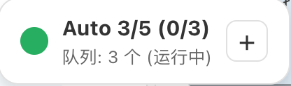

# Trae Auto Accept - TraeCN 自动接受扩展

专为 TraeCN 设计的 VS Code 扩展，提供自动化"接受全部"按钮点击功能。

## 软件截图
- 主界面

- 异步命令状态

- 暗色主题

- 最小化状态

- 退出提示


## 🎯 功能特点

- 🎯 **TraeCN 专用**：针对 TraeCN 界面深度优化
- 🤖 **自动点击**：智能监控并点击"接受全部"按钮
- 🎨 **精美界面**：深色/浅色主题，可拖拽控制面板
- 📱 **响应式设计**：最小化功能，优雅的交互体验
- 🛡️ **安全可靠**：本地运行，无网络请求，保护隐私
- 🗑️ **删除支持**：可选删除功能，带有安全确认机制
- 📝 **命令队列**：批量命令管理和自动执行
- 🔄 **智能状态检测**：准确识别Trae-CN输入状态
- 🎮 **高级控制**：命令排序、状态监控、批量操作

## 📥 安装指南

1. **下载扩展包**
   - 访问 [GitHub Releases](https://github.com/luw2007/trae-auto-accept/releases)
   - 下载最新的 `trae-auto-accept.vsix` 文件

2. **安装到 VS Code**
   - 打开 VS Code
   - 按 `Ctrl+Shift+P`（Windows/Linux）或 `Cmd+Shift+P`（macOS）
   - 输入：`Extensions: Install from VSIX...`
   - 选择下载的 `trae-auto-accept.vsix` 文件
   - 等待安装完成

3. **重启 VS Code**
   - 安装完成后重启 VS Code 确保扩展正常加载


## 🚀 使用流程

### 首次使用

1. **启动扩展**
   - 按 `Ctrl+Shift+P`
   - 输入：`启动 Trae 自动接受`
   - 按回车执行

2. **自动复制脚本**
   - 扩展会自动将插件脚本复制到剪贴板
   - 会显示提示信息："📋 插件脚本已复制到剪贴板，请在Trae 开发人员工具控制台中运行"

3. **打开Trae 开发人员工具控制台**
   - 会自动将 js 脚本复制到剪切板中。
   - 并且会自动打开 TraeCN 的开发人员工具
   - 手工切换到"控制台"标签

4. **运行脚本**
   - 在控制台中粘贴脚本（`Ctrl+V`）
   - 按回车执行

5. **开始使用**
   - 页面右上角会出现控制面板
   - 点击"启动"按钮开始自动接受
   - 控制面板可以拖拽移动位置

### 日常使用

- **启动/停止**：点击控制面板的"启动"/"停止"按钮
- **切换主题**：点击"主题"按钮切换深色/浅色模式
- **设置限额**：调整自动点击的次数限制
- **启用删除**：勾选复选框启用删除功能（红色警示）
- **最小化**：点击"－"按钮收起面板
- **展开**：点击最小化后的面板或"+"按钮
- **退出**：点击"退出"按钮完全移除脚本

### 🆕 异步命令队列功能

- **添加命令**：在输入框中输入命令，按Ctrl+Enter（Windows/Linux）或Cmd+Enter（macOS）组合键，或点击"发送"按钮
- **安全提交**：防止误触回车键提交，仅支持组合键提交方式
- **自动执行**：命令自动与 TraeCN 运行状态同步，避免冲突
- **智能等待**：检测 TraeCN 状态，等待合适的执行时机
- **命令管理**：支持拖拽排序、删除、状态监控
- **实时状态**：显示命令执行状态（待执行→、执行中⏳、已提交✅）
- **队列计数**：实时显示队列中命令数量和执行状态，标题显示格式为"(已提交数/总数)"
- **历史记录**：操作日志记录所有命令执行情况

## 🎮 插件脚本功能

### 控制面板
- **启动/停止**：一键切换自动接受状态
- **主题切换**：深色/浅色主题自由切换
- **点击限额**：设置自动点击次数限制（0-99，0为无限制）
- **删除功能**：安全启用删除功能，红色警示文字提醒
- **最小化**：收起为小巧图标，节省空间
- **退出**：完全移除脚本和界面

### 智能特性
- **按钮验证**：检查按钮文本为"全部接受"才点击
- **删除支持**：支持删除文件操作（需用户确认启用）
- **可见性检测**：只点击可见的按钮
- **自动收起**：启动后3秒自动最小化
- **拖拽移动**：可拖动到任意位置
- **状态指示**：彩色圆点显示运行状态
- **安全控制**：删除功能默认禁用，需要用户主动启用
- **直观计数**：标题计数显示格式为"(已提交数/总数)"，更加直观
- **清晰提示**：最小化状态下显示"已提交"而非"待执行"，避免混淆

## 🔧 故障排除

### 扩展无法启动
- 检查 VS Code 版本是否为 1.74.0+
- 重启 VS Code
- 重新安装扩展

### 脚本无法执行
- 确保在 TraeCN 页面运行脚本
- 检查Trae 开发人员工具控制台是否有错误信息
- 重新复制脚本到控制台

### 按钮无法点击
- 确保页面已完全加载
- 检查"接受全部"按钮是否存在
- 手动点击一次按钮测试功能

### 控制面板不显示
- 刷新页面重新运行脚本
- 检查是否有其他脚本冲突

## 📁 文件结构

```
trae-auto-accept/
├── package.json              # 扩展配置清单
├── extension.js              # VS Code 扩展主程序
├── trae-browser-script.js    # 自动化脚本
├── build.sh                 # 自动构建脚本
├── trae-auto-accept.vsix    # 打包好的扩展文件
├── README.md               # 项目文档
└── .vscodeignore           # 打包忽略规则
```

## 🔧 技术实现

### VS Code 扩展
- **启动方式**：`onStartupFinished` 自动激活
- **命令注册**：3个中文命令，直观易用
- **剪贴板集成**：自动复制插件脚本
- **开发工具**：自动打开/关闭控制台

### 插件脚本
- **IIFE封装**：立即执行函数，避免全局污染
- **DOM操作**：使用 `querySelector` 精准定位按钮
- **事件模拟**：真实的 `MouseEvent` 点击
- **CSS-in-JS**：动态样式，主题切换
- **缓冲管理**：日志条数限制，防止内存泄漏

## 🏗️ 开发构建

### 环境要求
- Node.js 14+
- VS Code 1.74.0+
- @vscode/vsce
- make (可选，用于自动化构建)

### 构建工具选择
本项目采用以下工具链进行构建和压缩：

1. **JavaScript压缩工具**：自定义minify-script.js
   - 功能：移除注释、压缩空格、保护字符串内容
   - 优势：轻量级、可定制、无外部依赖
   - 压缩率：约35%（73511 bytes → 47690 bytes）

2. **构建系统**：GNU Make + Shell脚本
   - 主构建：Makefile统一管理构建流程
   - 发布构建：build-release.sh自动处理压缩和打包
   - 开发构建：build.sh快速打包测试版本

3. **打包工具**：@vscode/vsce
   - 官方VS Code扩展打包工具
   - 支持.vsix格式，兼容VS Code Marketplace

### 构建命令

#### 标准构建流程
```bash
# 完整构建（推荐）
make build

# 单独压缩JavaScript
make minify

# 清理构建产物
make clean

# 安装依赖
make install-deps
```

#### 手动构建流程
```bash
# 安装打包工具
npm install -g @vscode/vsce

# 压缩JavaScript文件
node minify-script.js

# 打包扩展
make build-release
# 或
./build-release.sh
```

#### 开发构建
```bash
# 快速打包测试版本
./build.sh

# 或使用make
make dev
```

### 构建产物
- `trae-browser-script-min.js`：压缩后的浏览器脚本（~47KB）
- `trae-auto-accept.vsix`：VS Code扩展安装包（~46KB）
- 构建日志：显示压缩率和文件统计信息

### 文件结构
```
trae-auto-accept/
├── Makefile                  # 构建系统配置
├── minify-script.js          # JavaScript压缩工具
├── build-release.sh          # 发布构建脚本
├── build.sh                  # 开发构建脚本
├── trae-browser-script.js    # 原始浏览器脚本
├── trae-browser-script-min.js # 压缩后脚本
├── trae-auto-accept.vsix     # 最终扩展包
└── ...
```

## 📊 版本信息

### 当前版本 v1.13.0
- 🔄 优化标题计数显示方式，将"(1/2)"中的"1"从待执行数量改为成功数量
- 📝 修改最小化提示文字，从"待执行"改为"已提交"，使显示更加直观
- 🛡️ 修复回车提交代码问题，防止误触提交，支持Ctrl+Enter（Windows/Linux）和Cmd+Enter（macOS）提交方式
- 🎨 改进用户界面交互体验，优化控制面板显示逻辑
- 📦 版本升级到v1.13.0

### v1.12.2
- 📝 完善 CLAUDE.md 开发指导文档
- 🔧 增加开发命令和技术架构说明
- 📦 版本升级到v1.12.2
- 🎯 添加开发指南和常见问题解决方案

### v1.12.1
- 🔧 添加publisher字段修复发布问题
- 🎮 添加停止命令并优化浏览器脚本界面
- 🔇 优化日志输出，减少不必要的日志显示
- 📦 版本升级到v1.12.1并重新打包扩展

### v1.11.0
- 🔇 优化日志输出，减少不必要的日志显示
- 🎯 只在成功点击和错误时显示日志，其他情况静默处理

### v1.10.0
- 🎯 完善安装说明和使用指南
- 📦 更新作者信息为 luw2007
- 🔧 优化自动最小化功能
- 📱 改进用户体验

📖 [完整版本历史](https://github.com/luw2007/trae-auto-accept/releases)

## 📋 使用提示

- **首次使用**：建议按照"快速开始"流程操作
- **脚本执行**：在Trae 开发人员工具控制台粘贴脚本后按回车
- **控制面板**：点击右上角"－"按钮可最小化
- **主题切换**：点击"主题"按钮在深色/浅色间切换
- **安全退出**：点击"退出"按钮完全移除脚本

## 🔒 安全说明

- **本地运行**：所有操作都在本地完成，无数据上传
- **开源透明**：完整源代码，可审查安全性
- **最小权限**：仅操作DOM，不访问其他网站数据
- **无追踪**：不收集任何用户信息

## 🤝 支持与反馈

- **GitHub Issues**：[提交问题](https://github.com/luw2007/trae-auto-accept/issues)
- **GitHub Releases**：[下载最新版本](https://github.com/luw2007/trae-auto-accept/releases)
- **VS Code Marketplace**：[扩展页面](https://marketplace.visualstudio.com/items?itemName=luw2007.trae-auto-accept)

## 📄 许可证

本项目采用 MIT 许可证，详见 [LICENSE](LICENSE) 文件。

---

**享受自动化的便利！** 🎉